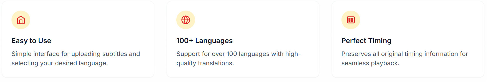
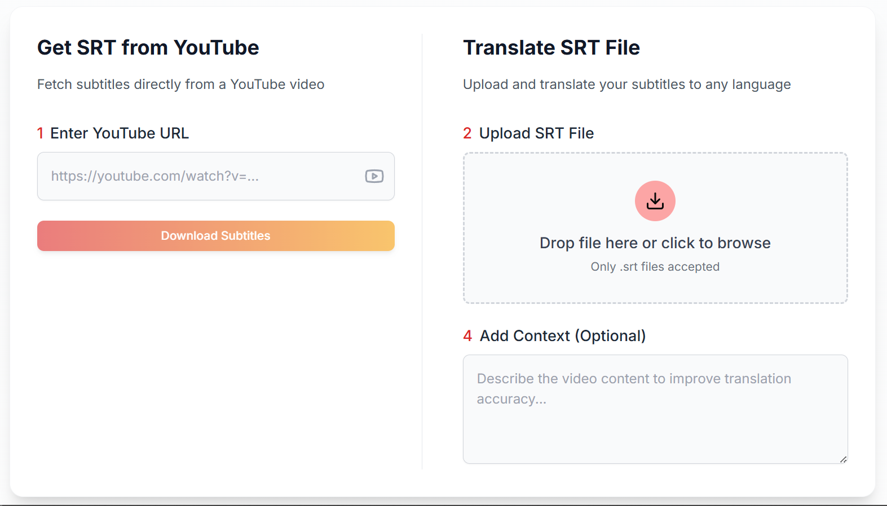

# 🎬 YouTube to SRT Subtitle Translator

This web app simplifies subtitle management by allowing you to:

- Extract subtitles directly from YouTube videos
- Upload `.srt` subtitle files
- Translate subtitles into over 100 languages
- Optionally provide context to improve translation accuracy

Built using **Next.js**, **React**, **Tailwind CSS**, and AI-powered translation APIs.

---

## Demo

[Check out the live demo here](https://autotranscript-two.vercel.app/)

---

## ✨ Key Features

- **Easy to Use**  
  Straightforward interface for uploading subtitles and choosing your target language.

- **100+ Languages**  
  Translate subtitles into over 100 supported languages with high-quality AI translations.

- **AI-Driven Subtitle Translation**
  Automatically translate subtitles into different languages with context to enhance accuracy.

- **Perfect Timing**  
  Preserves original subtitle timings for smooth playback and synchronization.

---

## 🛠️ How It Works

### 1. Get SRT from YouTube
Enter any YouTube video URL, and the app will fetch its available subtitles.

### 2. Upload SRT File
Already have subtitles? Simply upload your `.srt` file to start translating.

### 3. Add Context *(Optional)*
Provide context about the video (e.g., topic, tone, or target audience) to improve translation quality.

### 4. Download Translated File
Once translated, subtitles are ready to download and use.

---

> This app is ideal for content creators, educators, and multilingual teams who need fast and reliable subtitle translations without losing time or sync.

